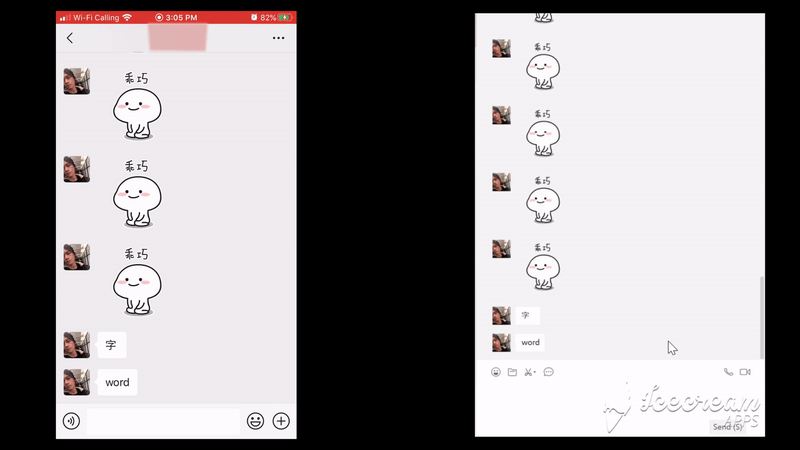

# AntiRecall (For Telegram, WeChat, and QQ)

      

## This project will be maintained frequently, I'm looking for someone else who takes charge of it

:crescent_moon: English | :sleeping:[简体中文](/README-zh.md)

Anti-Recall is a tool that prevents messages from deleting/revoking/recalling. It currently supports  **Telegram**, **WeChat**, and **QQ**.

## Support

- Prevent messages from deleting/revoking by server (*Telegram* :heavy_check_mark: *WeChat* :heavy_check_mark: *QQ* :heavy_check_mark:)
- Hot patch without modifying original application
- No overhead due to the binary level patching
- Tag deleted message (Tagging deleted message bases on [Telegram-Anti-Revoke](https://github.com/SpriteOvO/Telegram-Anti-Revoke ))

## Download

[github release](https://github.com/FlyRabbit/AntiRecall/releases)

## Demo

##### Telegram :arrow_down_small:

##### WeChat :arrow_down_small:

##### QQ :arrow_down_small:

## How to use it?

## To-do 

- View the original content of edited messages(Telegram)
